# 1. 프로젝트 생성하기

모든 프로젝트 코드는 [Github](https://github.com/jojoldu/springboot-webservice) 에 있습니다.  

## 1-1. SpringBoot & Gradle 프로젝트 생성하기

IntelliJ 혹은 Eclipse로 스프링부트 프로젝트를 생성합니다.  

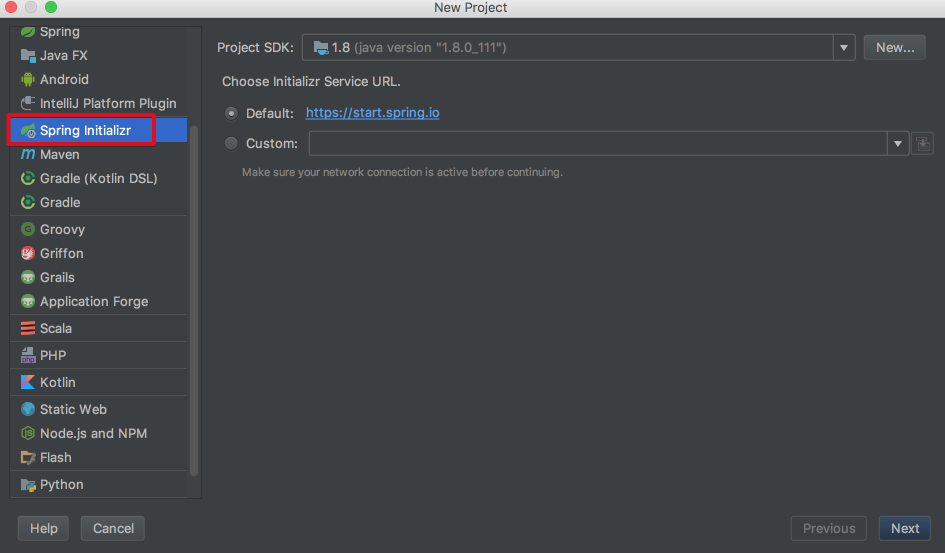

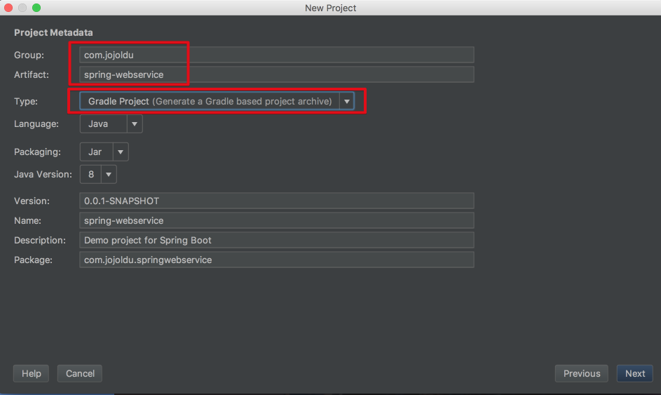

저는 기본 패키지를 ```com.jojoldu```로 했지만, 여러분은 다른 이름으로 하셔도 됩니다.  
빌드툴은 Maven이 아닌, Gradle을 선택합니다.  

> Tip)  
Maven을 선택하셔도 무방합니다만, 최근 Gradle이 4.x대로 버전업하면서 빌드속도가 대폭 개선됐으며,  
다양한 Task를 쉽게 생성가능해서 많은 프로젝트에서 도입중입니다.  
이번 기회에 시작해보시는것도 좋을것 같습니다.


* Core의 Lombok
* Web의 Web
* SQL의 JPA, H2
* OPS의 Actuators

를 선택합니다.

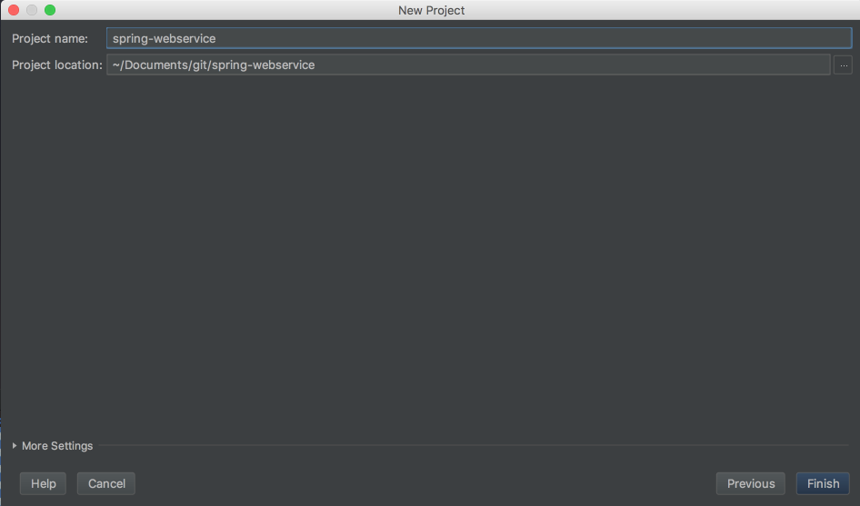

프로젝트 위치를 지정후, 완료(Finish) 버튼으로 프로젝트 생성을 완료합니다.  
  
프로젝트 생성이 끝나면 Gradle의 설정파일인 build.gradle은 아래와 같은 형태가 됩니다.

build.gradle

```.groovy
buildscript {
	ext {
		springBootVersion = '1.5.9.RELEASE'
	}
	repositories {
		mavenCentral()
	}
	dependencies {
		classpath("org.springframework.boot:spring-boot-gradle-plugin:${springBootVersion}")
	}
}

apply plugin: 'java'
apply plugin: 'eclipse'
apply plugin: 'org.springframework.boot'

group = 'com.jojoldu'
version = '0.0.1'
sourceCompatibility = 1.8

repositories {
	mavenCentral()
}


dependencies {
	compile('org.springframework.boot:spring-boot-starter-actuator')
	compile('org.springframework.boot:spring-boot-starter-data-jpa')
	compile('org.springframework.boot:spring-boot-starter-web')
	runtime('com.h2database:h2')
	compileOnly('org.projectlombok:lombok')
	testCompile('org.springframework.boot:spring-boot-starter-test')
}

```

자동생성된 패키지명이 조금 길기 때문에 src/main/java/com/jojoldu 아래의 springwebservice 패키지명을 webservice로 변경하겠습니다.  

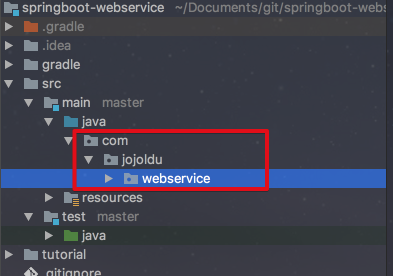

webservice 패키지 아래에 있는 SpringWebserviceApplication.java 파일로 Application.java로 변경하겠습니다.  
그리고 추가로 webservice 패키지 아래에 web이란 패키지를 생성해서 WebRestController.java 파일을 생성하겠습니다.  

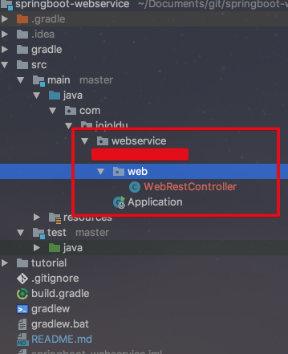

WebRestController에는 다음과 같은 코드가 있습니다.  

```java
@RestController
public class WebRestController {

    @GetMapping("/hello")
    public String hello() {
        return "HelloWorld";
    }
}

```

다들 아시겠지만 ```@RestController```는 ```@ResponseBody```를 모든 메소드에서 적용해줍니다.  
즉 ```hello``` 메소드의 결과는 ```"HelloWorld"``` 라는 문자열을 JSON 형태로 반환하게 됩니다.  
자 그럼 이 프로젝트를 실행해보겠습니다.  
  
Application.java 를 실행합니다.

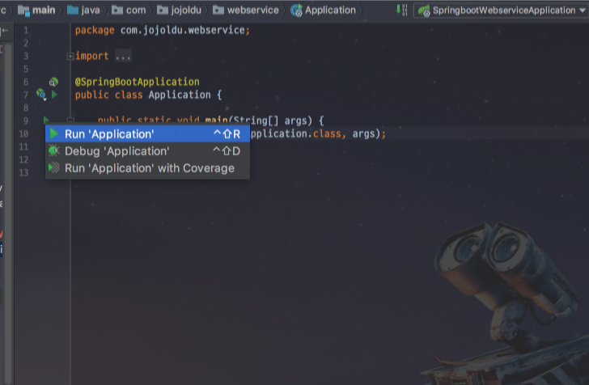

그리고 브라우저에서 localhost:8080/hello 로 접속합니다.


이렇게 간단하게 Rest API가 호출됨을 확인할 수 있습니다.  
간단한 Hello World 프로젝트 구축이 되었습니다.  

## 1-2. Github 연동하기

이번엔 방금 생성한 이 프로젝트를 Github 와 연동해보겠습니다.  
  
> Tip)  
보통 SI프로젝트에선 SVN을 많이들 사용하시는데, 개인프로젝트나 자사 서비스를 운영하는 곳에선 대부분 코드 관리를 Git으로 진행합니다.  
Git은 DVCS라고해서 **코드 관리를 로컬저장소와 원격저장소 양쪽에서 관리**할 수 있다는 장점이 있습니다.  
(SVN은 원격저장소밖에 없습니다.)  
더군다나 굳이 코드 관리용 서버를 구축할 필요 없이 Github를 사용하면 바로 원격 저장소를 사용할 수 있기 때문에 무조건 Git을 사용하는게 더 낫다고 생각하셔도 됩니다.  
  

### Git + Source Tree

만약 본인의 개발환경이 Window + Eclipse라면 이전에 작성한 [블로그 글](http://jojoldu.tistory.com/16)을 참고하시면 됩니다.  
  
[Git 사이트](https://git-scm.com/)에 접속하셔서 본인의 운영체제에 맞는 설치 파일을 받아 설치합니다.  
  
설치가 끝나시면 IntelliJ 사용자시면 ```option(or Alt)+F12```를 클릭하시면 IDE 하단에 터미널 화면이 활성화 됩니다.  
여기서 git init을 입력합니다.


그럼 프로젝트가 Git 프로젝트로 전환된 것을 확인할 수 있습니다.  
이후, [Source Tree 사이트](https://ko.atlassian.com/software/sourcetree)에서 설치파일을 받아 설치합니다.  
실행하신뒤 New.. -> Add Exisiting Local Repository 를 클릭합니다.  

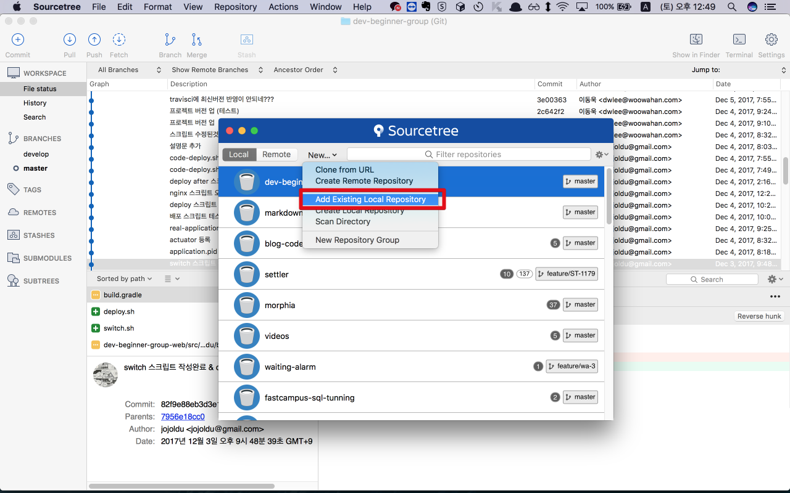

생성한 본인의 프로젝트를 선택하신후 Open 버튼을 클릭합니다.

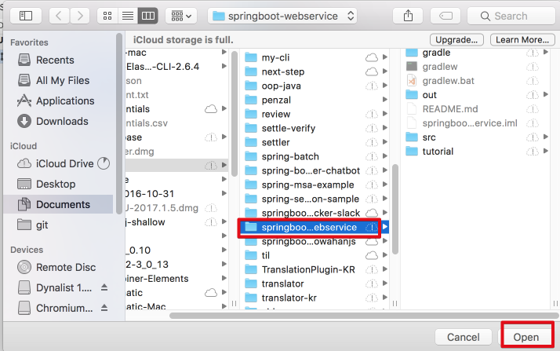

그럼 로컬 Git은 연동이 되었습니다.  
원격 저장소인 Github와 연동을 진행하겠습니다.  

### Github 연동하기

[Github 사이트](https://github.com/)로 접속해서 본인의 저장소를 생성합니다.  

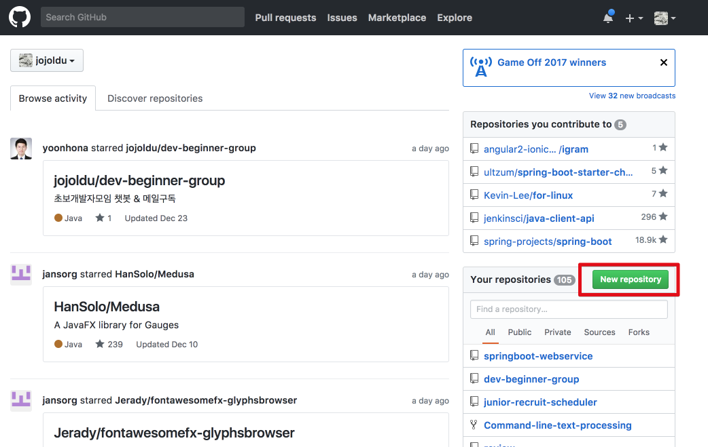

생성 페이지에 접속하시면 본인의 프로젝트 명과 동일한 이름으로 Repository name을 등록합니다.  
(달라도 문제는 없지만 이왕이면 같은 이름이 구분하기 쉽겠죠?)  

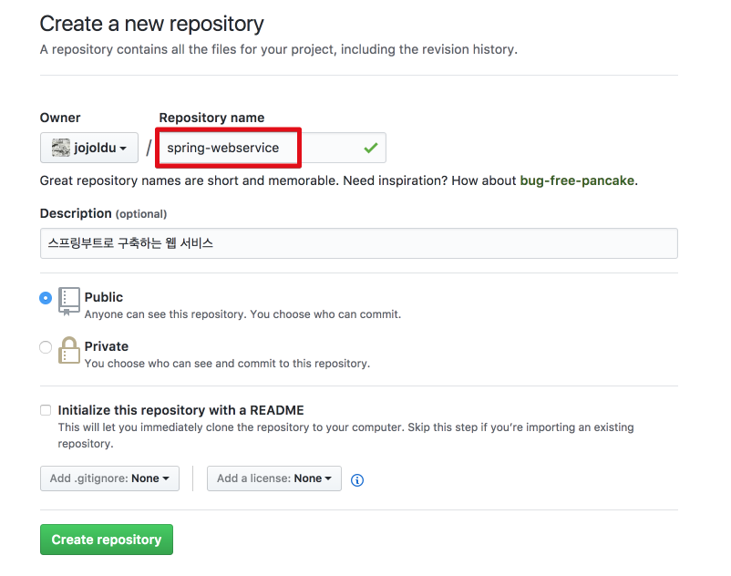

생성하시면 링크만 있는 페이지가 나옵니다. 

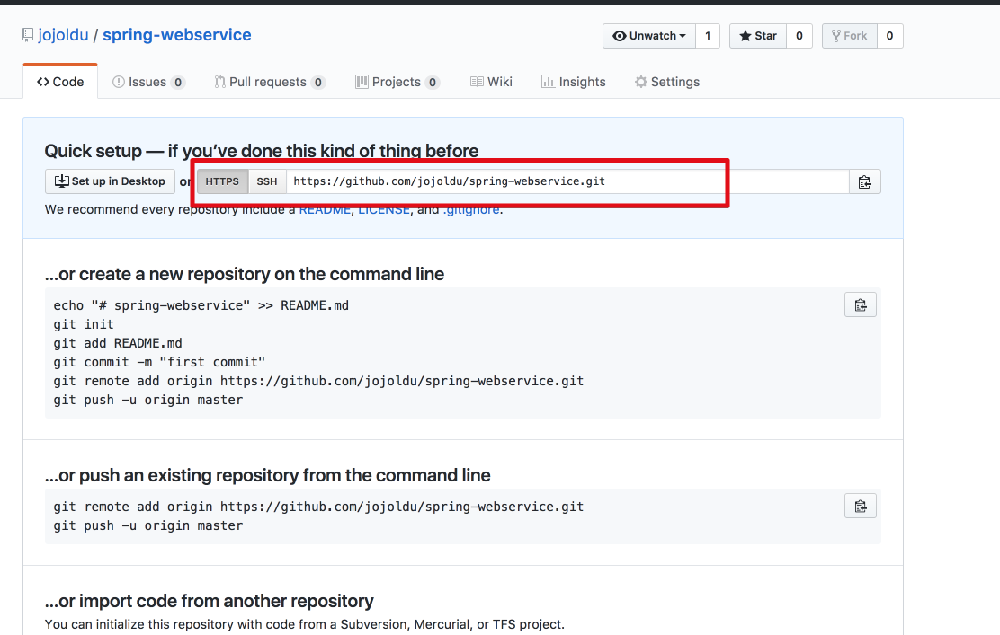

HTTPS 주소를 복사합니다.  
(여기선 ```https://github.com/jojoldu/spring-webservice.git```가 됩니다.)  

이를 로컬의 프로젝트와 연동하겠습니다.  
Source Tree에서 프로젝트를 선택후 상단 메뉴바의 ```Repository``` -> ```Repository Settings...``` 를 선택합니다.  

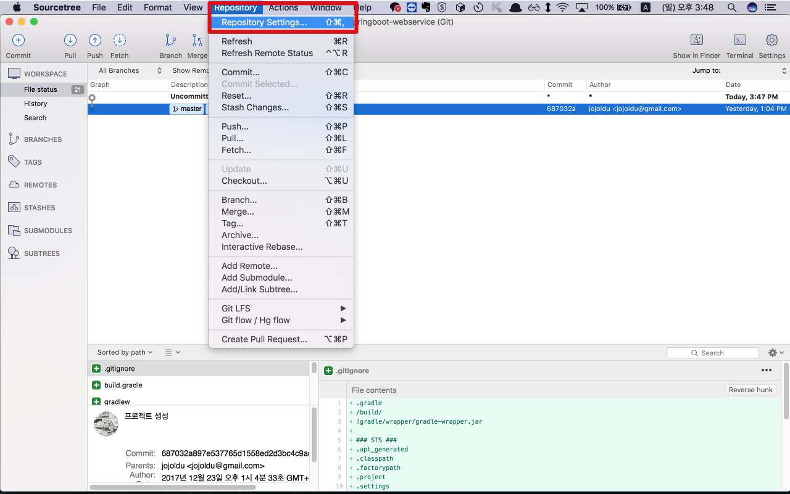

remote 탭을 클릭 -> add 버튼을 클릭합니다.

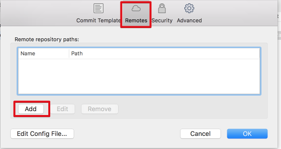

아래를 참고하시어 각 입력값을 채웁니다.  

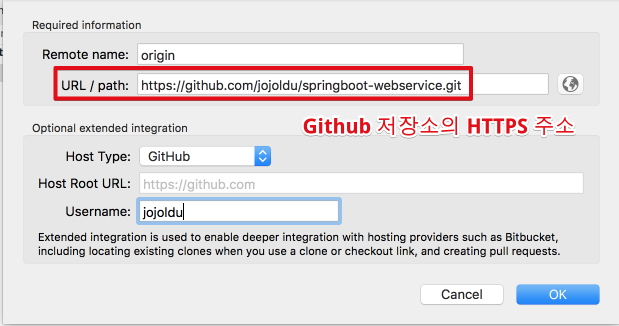

(remote name은 origin을 표준으로 사용하기 때문에 origin을 입력하시면 됩니다.)  
  
Github과 연동은 끝났습니다.  
이제 첫번째 커밋을 진행하겠습니다.  
진행하기에 앞서!  
Git에서 관리하지 않는 대상들을 제거하겠습니다.  
  
프로젝트 내부에 ```.gitignore``` 파일을 생성합니다.

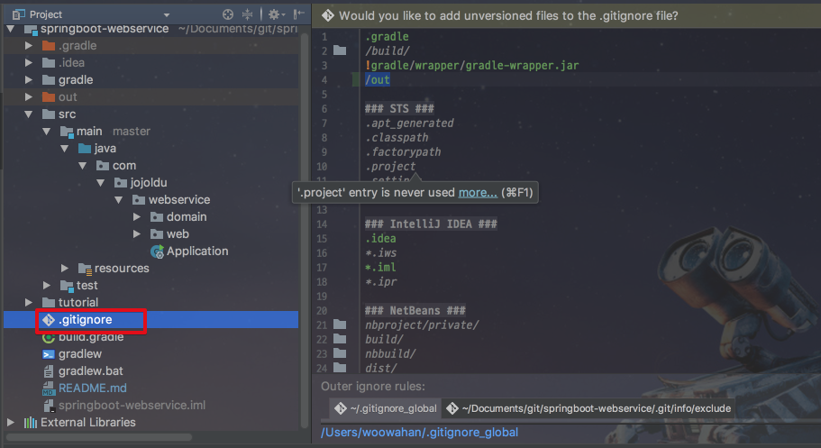

그리고 아래 내용을 그대로 복사해서 붙여넣겠습니다.  
아래는 보통 표준적으로 프로젝트에서 제거하는 ```.gitignore``` 내용입니다.  
각 IDE에서 프로젝트가 생성되면 **자동으로 생성되는 파일들은 굳이 Git으로 관리할 필요가 없기 때문에** Git 체크대상에서 제외합니다.  

```ignore
.gradle
/build/
!gradle/wrapper/gradle-wrapper.jar
/out

### STS ###
.apt_generated
.classpath
.factorypath
.project
.settings
.springBeans

### IntelliJ IDEA ###
.idea
*.iws
*.iml
*.ipr

### NetBeans ###
nbproject/private/
build/
nbbuild/
dist/
nbdist/
.nb-gradle/
```

 ```.gitignore``` 파일 생성마저 끝났으면 이제 진짜 커밋과 푸시를 진행하겠습니다.  

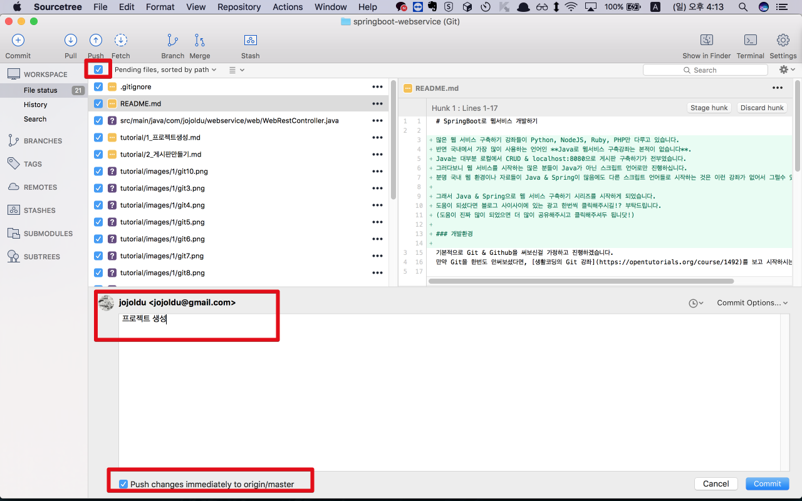

하단의 push 체크박스를 체크한 뒤 Commit 버튼을 클릭하시면!


이렇게 커밋과 푸시가 된 것을 확인할 수 있습니다.  
본인의 Github 주소로 방문 해보시면! 

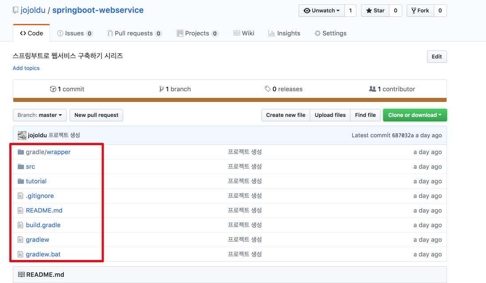

코드가 올라간 것을 확인할 수 있습니다.  
  
이미 Git을 아시는 분들은 10분이면 끝날 내용이라고 생각합니다.  
크게 부담이 없으셨을것 같습니다.  
다음시간에는 SpringBoot & JPA로 간단한 CRUD 서비스를 진행하겠습니다.  
감사합니다!
